# Hangman

## Introduction

Welcome to the Hangman Game Project! This classic word-guessing game has entertained players for generations, blending strategy, vocabulary, and a dash of suspense. The objective is simple: guess the hidden word by suggesting letters within a limited number of attempts. Each incorrect guess brings the player closer to losing, while each correct letter gradually reveals the mystery word.

In this project, we are implementing a digital version of Hangman where both human players and the computer can participate. Players can compete against the computer, which will randomly select words and make guesses, adding an exciting twist to the traditional gameplay. Additionally, users can challenge themselves against different difficulty levels and a diverse word bank, enhancing the educational value of the game.

This documentation will guide you through the development process, detailing the game's design, features, and technical specifications. Join us as we explore the world of Hangman and create a memorable gaming experience for everyone involved!

## Installation

Follow these steps to set up the project on your local machine:

### Prerequisites

- Python 3.6 or higher
- Pip (Python package installer)

### Steps

1. **Clone the repository** (if applicable):
   ```bash
   git clone <repository-url>
   cd Hangman
   ```

2. **Create a virtual environment**:
   ```bash
   python -m venv env
   ```

3. **Activate the virtual environment**:
* On Windows:
   ```bash
   .\env\Scripts\activate
   ```
* On macOS/Linux:
    ```bash
    source env/bin/activate
    ```

4. **Create a `.env` file**:
In the root of your project directory, create a file named `.env` and add the following lines, replacing `your_mysql_username` and `your_mysql_password` with your actual MySQL credentials:

    ```makefile
    DB_USER=your_mysql_username
    DB_PASS=your_mysql_password
    ```

5. **Install the required packages** (if applicable):
Run:
   ```bash
   pip install -r requirements.txt
   ```

6. **Run the application** (if applicable):
 After installation, you can start the game with:
   ```bash
   python hangman.py
   ```

# Project Overview

This project aims to develop a digital version of the classic Hangman game using Python, the Tkinter graphical user interface (GUI) toolkit, and a MySQL database.

## Game Modes

We offer two engaging gaming modes:

### 1. Player vs. Computer

In this mode, the user attempts to guess a word randomly selected by the computer. The process is as follows:

- The computer generates a random word from the database.
- The program displays the length of the word using empty spaces for each letter.
- The user is prompted to guess letters that may be present in the word.
- The computer provides feedback on the guesses, filling in the correct letters in their corresponding positions.
- The game tracks the number of attempts remaining.
- Players win by guessing the word within eight attempts; otherwise, they lose.

### 2. Computer vs. User

In this mode, the user thinks of a word, and the program attempts to guess it. Here’s how it works:

- The user selects a word and inputs its length.
- The program generates random character guesses and asks the user for feedback on each letter's presence and position.
- Initially, the program uses common, frequently occurring letters for its guesses. Based on the user's feedback, it shifts to more educated guesses, filtering potential words from the database that match the letters already identified.
- This iterative guessing process continues until the program narrows down to a single word based on the user's responses.

The Tkinter GUI toolkit enhances the user experience by providing an interactive and user-friendly interface, ensuring smooth gameplay and making it accessible for players of all ages.

# Methodology

## Approach and Methodology Employed

The game features two distinct modes: one where the user guesses a word and another where the computer attempts to guess the user's word. 

### 1. User Guessing Mode
- A random word is selected from a database, leveraging the `random` module to ensure a fair and varied gameplay experience. The program tracks both correct and incorrect guesses to guide the user’s attempts.

### 2. Computer Guessing Mode
- In this mode, the computer starts by identifying the positions of any vowels in the target word, followed by guessing consonants. This structured approach enhances the computer's guessing strategy, making it more effective in determining the word.

### 3. Learning Functionality
- If the program fails to guess the correct word, a learning function is triggered, allowing the program to update its knowledge base for future games.

## Code Structure
The implementation is divided among three main files:
- **`main.py`**: Handles the core logic for both game modes, processing user inputs and managing game state.
- **`dbcon.py`**: Facilitates database interactions, executing MySQL commands as Python strings to fetch words based on user inputs.
- **`gui.py`**: Manages the graphical user interface, defining the layout and handling user interactions by relaying inputs to `main.py` and `dbcon.py`.

## Tools, Technologies, and Frameworks Used

### Modules and Libraries
- **`os`**: Utilized for database setup and management.
- **`random`**: Employed for selecting random words and generating letter guesses.
- **`mysql.connector`**: Used to execute MySQL commands within the Python environment, facilitating efficient database operations.
- **`tkinter`**: The framework for developing the user interface, providing an interactive experience for users.

In addition to standard Python functionalities, MySQL serves as a robust solution for organizing the word list, allowing for efficient lookups and input manipulation, enhancing the overall gameplay experience.

# Screenshots


## User vs Computer

Word is godforsaken🤫

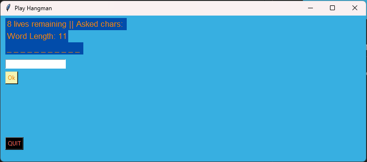
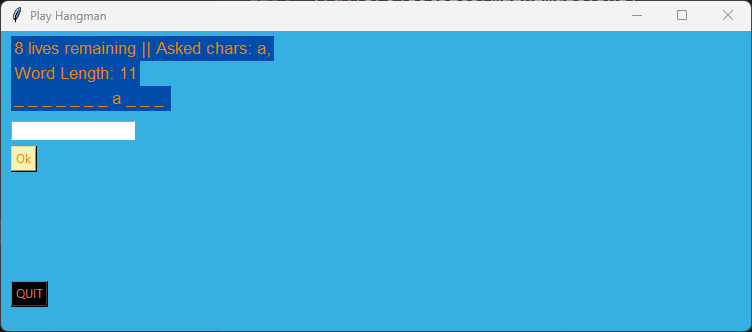
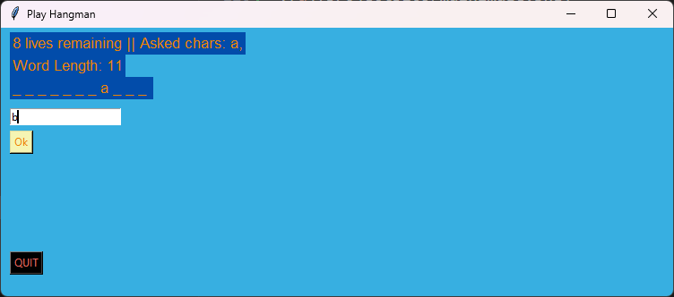
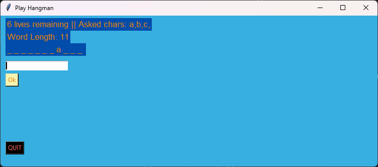
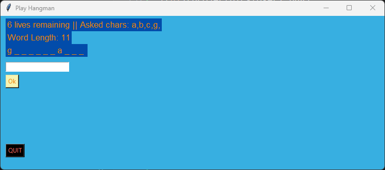
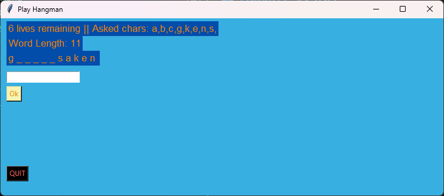
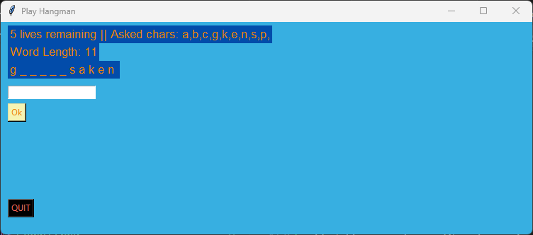
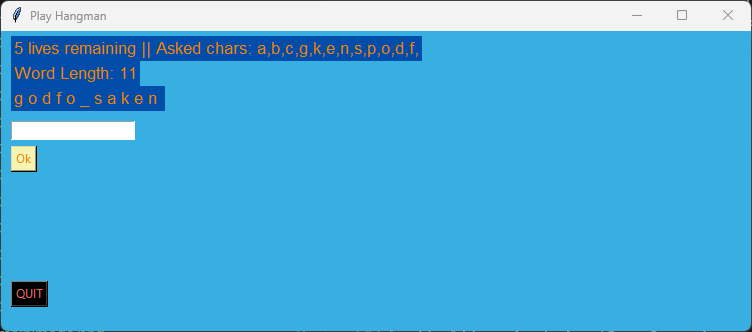
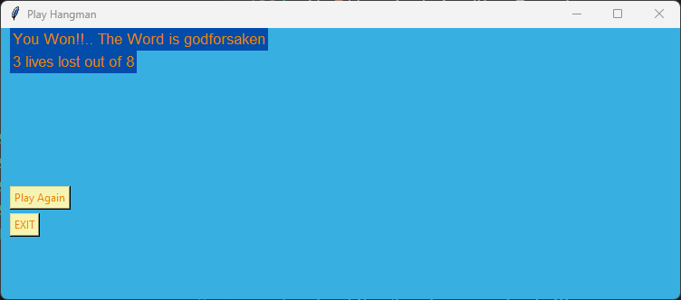

## Computer vs User

Word is abacus🤫


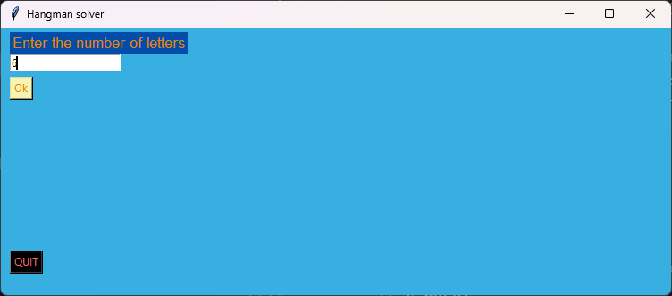


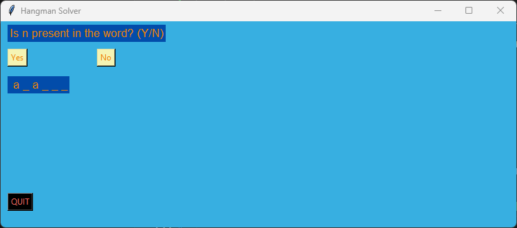

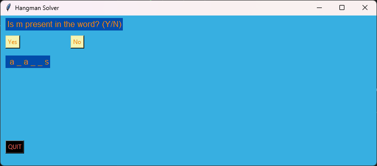

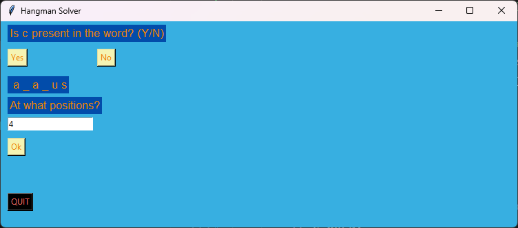

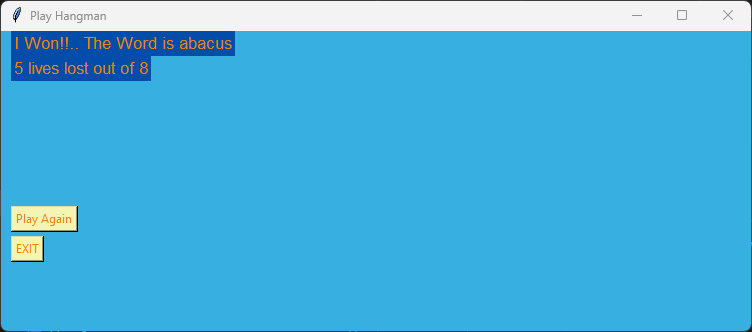